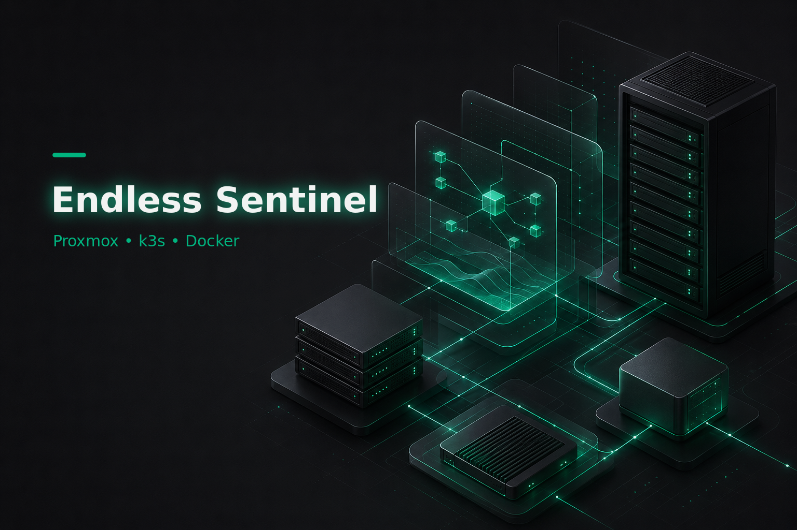
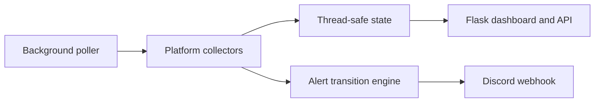

# Endless Sentinel

Endless Sentinel is a Python homelab resource monitor that combines Proxmox VE, k3s/Kubernetes, and Docker health in one responsive Flask dashboard. A background collector polls each enabled platform, keeps a bounded in-memory history, detects alert transitions, and sends deduplicated Discord webhook notifications.



## Brand palette

The dashboard is built around the supplied two-colour reference: charcoal `#171719` and emerald `#00B37E`. Lighter emerald is used only to distinguish overlapping chart series; amber and red remain reserved for warning and critical states so incidents stay immediately recognisable.

## What it monitors

- **Proxmox VE:** node availability, CPU utilization, memory utilization, warning thresholds, and critical thresholds.
- **k3s / Kubernetes:** node Ready conditions, pod phases, container waiting reasons, readiness, and restart totals.
- **Docker:** local or explicitly configured remote-daemon reachability, running/stopped state, Docker health checks, CPU, memory, and restart-count increases.
- **Discord:** grouped alert embeds, severity colours, delivery state, optional recovery notices, and a dashboard test action.
- **Dashboard:** live API refresh, manual poll action, utilization history, mobile navigation, status-aware favicon, success/error toasts, and custom 404/500 pages.

## Architecture



Each collector has its own failure boundary. If one API times out, that source reports a structured connection incident while the other collectors and web server continue running. Alerts are sent when a condition first appears or changes severity; they are not resent on every poll. When enabled, a recovery message is sent after the condition clears.

## One-command setup in a Proxmox LXC

The installer is designed to run as root in a fresh Debian or Ubuntu LXC. Before starting the LXC, enable **Nesting** and **Keyctl** in Proxmox under **LXC → Options → Features**, then fully restart it. [Proxmox documents Keyctl as required for Docker in an unprivileged container](https://pve.proxmox.com/wiki/Manual%3A_pct.conf); the installer detects LXC but cannot change host-level Proxmox settings from inside it.

The exact command also requires `curl` to already exist because `curl` is what downloads the installer. If a minimal template does not include it, run this once inside the LXC:

```bash
apt-get update && apt-get install -y curl
```

After the GitHub repository is public, run:

```bash
curl -fsSL https://raw.githubusercontent.com/the0neand0nly/Endless-Sentinal/main/setup.sh | bash -s -- --configure
```

From that point onward the installer is automatic. It:

1. installs Git, CA certificates, OpenSSL, and other small prerequisites when missing;
2. clones the project into `/opt/endless-sentinel` when run as root;
3. detects a Proxmox LXC and explains the required host features if Docker cannot start;
4. installs Docker Engine, Buildx, and the Docker Compose plugin using Docker's official [Debian](https://docs.docker.com/engine/install/debian/) or [Ubuntu](https://docs.docker.com/engine/install/ubuntu/) APT repository;
5. starts and verifies the Docker daemon;
6. prompts for Proxmox, k3s, local Docker monitoring, Discord alerts, and the dashboard port;
7. stores secrets in an owner-only `.env`, builds the application, and waits for a healthy container; and
8. prints the dashboard URL and log command.

The script deliberately refuses to overwrite a non-empty unrelated directory. It is safe to rerun: an existing project, `.env`, Docker installation, and configured values are reused.

To choose a different installation directory:

```bash
curl -fsSL https://raw.githubusercontent.com/the0neand0nly/Endless-Sentinal/main/setup.sh | \
  ENDLESS_SENTINEL_INSTALL_DIR=/srv/endless-sentinel bash -s -- --configure
```

The raw GitHub command requires a public repository. For a private repository, clone it with an authenticated Git client and use the local command below.

From an existing project checkout, run:

```bash
./setup.sh --configure
```

Standalone download behaviour can be changed with `ENDLESS_SENTINEL_INSTALL_DIR`, `ENDLESS_SENTINEL_REPOSITORY_URL`, and `ENDLESS_SENTINEL_BRANCH`. The default repository is `https://github.com/the0neand0nly/Endless-Sentinal.git` on the `main` branch.

The GitHub path above intentionally keeps the repository spelling you supplied (`Endless-Sentinal`). The product name, container resources, environment variables, and default install directory use the correctly spelled `Endless Sentinel` / `Endless-Sentinel` brand.

Open `http://<LXC-IP>:8080` after setup finishes, or use the custom port selected during configuration. Ensure the Proxmox firewall permits that port from the devices that should access the dashboard.

To use an existing `.env` without prompts:

```bash
./setup.sh --non-interactive
```

To prepare configuration without installing or starting Docker:

```bash
./setup.sh --configure --no-start
```

To require an existing Docker installation instead of allowing automatic installation:

```bash
./setup.sh --configure --skip-docker-install
```

### What the LXC installation actually monitors

| Layer | What the default LXC installation covers |
| --- | --- |
| Proxmox | Connects to the Proxmox API and monitors every Proxmox **node's** availability, CPU, and RAM. It does not yet report each individual VM or LXC as a separate resource. |
| Docker | Installs Docker inside the monitoring LXC and monitors every container on that LXC's Docker daemon, including Endless Sentinel itself. It does not automatically install agents on or discover Docker daemons on other machines. |
| k3s | Monitors the cluster described by the kubeconfig copied into the LXC. Nodes and pods are queried through the Kubernetes API. |
| Discord | Sends threshold, availability, restart, and optional recovery alerts through the webhook entered during setup. |

To monitor Docker on another host, configure a secured remote Docker endpoint in `.env`; do not expose an unauthenticated Docker TCP socket. Alternatively, run one Endless Sentinel instance on each separate Docker host.

If this is a dedicated monitoring LXC, its local Docker daemon will normally contain only Endless Sentinel. For useful Docker workload metrics without remote-Docker configuration, install Endless Sentinel in the LXC or VM that already runs those Docker workloads.

## Manual Python setup

Python 3.11 or newer is recommended.

```bash
python3 -m venv .venv
source .venv/bin/activate
python -m pip install -r requirements.txt
cp .env.example .env
```

Edit `.env`, then start Endless Sentinel:

```bash
python app.py
```

The development server listens on `0.0.0.0:8080` by default. For a production process outside Docker, retain one Gunicorn worker so only one background poller is created:

```bash
gunicorn --bind 0.0.0.0:8080 --workers 1 --threads 4 app:app
```

## Configuration

All sensitive values and connection paths are read from environment variables. Do not put API tokens, passwords, kubeconfigs, certificates, or webhook URLs in source control.

### Application settings

| Variable | Default | Purpose |
| --- | --- | --- |
| `FLASK_SECRET_KEY` | generated by `setup.sh` | Signs Flask flash-message sessions. Set a stable random value in production. |
| `FLASK_HOST` | `0.0.0.0` | Bind address used by `python app.py`. |
| `FLASK_PORT` | `8080` | Port used by `python app.py`. |
| `ENABLE_BACKGROUND_POLLER` | `true` | Starts the platform polling thread. Disable it in tests. |
| `POLL_INTERVAL_SECONDS` | `30` | Seconds between collector cycles; minimum is 10. |
| `DASHBOARD_REFRESH_SECONDS` | `10` | Browser refresh interval; minimum is 5. |
| `HISTORY_LENGTH` | `120` | Number of in-memory utilization points to retain. |
| `SEND_RECOVERY_ALERTS` | `true` | Sends Discord notices when active conditions clear. |
| `LOG_LEVEL` | `INFO` | Python log level. Webhook URLs and token values are never logged. |

### Proxmox VE

| Variable | Purpose |
| --- | --- |
| `PROXMOX_ENABLED` | Enables or disables the collector. Without an explicit value, a configured host enables it. |
| `PROXMOX_HOST` | Proxmox hostname or HTTPS URL. Port 8006 is assumed when omitted. |
| `PROXMOX_USER` | API identity, such as `endless-sentinel@pve`. |
| `PROXMOX_TOKEN_NAME` | API token identifier. |
| `PROXMOX_TOKEN_VALUE` | API token secret. Preferred over a password. |
| `PROXMOX_PASSWORD` | Password fallback when no token is configured. |
| `PROXMOX_VERIFY_SSL` | Verifies the Proxmox TLS certificate. Keep `true` with a trusted certificate. |
| `PROXMOX_TIMEOUT_SECONDS` | API request timeout. |
| `PROXMOX_CPU_WARNING` / `PROXMOX_CPU_CRITICAL` | CPU percentage thresholds; defaults are 80 and 95. |
| `PROXMOX_MEMORY_WARNING` / `PROXMOX_MEMORY_CRITICAL` | Memory percentage thresholds; defaults are 80 and 95. |

Recommended Proxmox setup:

1. Create a dedicated monitoring user.
2. Create a separated-privilege API token for that user.
3. Grant the minimum audit permissions needed to read cluster and node status, commonly the built-in `PVEAuditor` role at the required scope.
4. Put only the user, token name, and token secret in `.env`.
5. Use a valid certificate and leave `PROXMOX_VERIFY_SSL=true`.

Example:

```dotenv
PROXMOX_ENABLED=true
PROXMOX_HOST=https://pve.internal.example:8006
PROXMOX_USER=endless-sentinel@pve
PROXMOX_TOKEN_NAME=monitor
PROXMOX_TOKEN_VALUE=stored-only-in-env
```

### k3s / Kubernetes

| Variable | Purpose |
| --- | --- |
| `K3S_ENABLED` | Enables or disables the collector. |
| `K3S_KUBECONFIG` | Kubeconfig path as seen by Endless Sentinel. Docker Compose uses `/config/kubeconfig`. |
| `K3S_KUBECONFIG_HOST` | Host path mounted into the Compose container. |
| `K3S_CONTEXT` | Optional kubeconfig context name. |
| `K3S_IN_CLUSTER` | Uses the pod service account instead of a kubeconfig. |
| `K3S_TIMEOUT_SECONDS` | Kubernetes API timeout. |
| `K3S_RESTART_WARNING` | Pod restart total that creates a warning. |

When using Docker Compose, the kubeconfig's API server must be reachable from inside the container. A kubeconfig pointing at `127.0.0.1` usually needs a reachable host address instead. Give the identity read-only access to nodes and pods.

Example host configuration:

```dotenv
K3S_ENABLED=true
K3S_KUBECONFIG=/config/kubeconfig
K3S_KUBECONFIG_HOST=/etc/rancher/k3s/k3s.yaml
K3S_IN_CLUSTER=false
```

### Docker

| Variable | Purpose |
| --- | --- |
| `DOCKER_ENABLED` | Enables or disables Docker monitoring. |
| `DOCKER_HOST` | Local Unix socket or secured remote TCP Docker Engine endpoint. |
| `DOCKER_SOCKET_PATH` | Host socket mounted by Docker Compose. |
| `DOCKER_GID` | Host Docker socket group ID added to the non-root container user. |
| `DOCKER_TLS_VERIFY` | Enables TLS verification for a remote TCP endpoint. |
| `DOCKER_CERT_PATH` | Container path containing `ca.pem`, `cert.pem`, and `key.pem`; Compose uses `/config/docker-certs`. |
| `DOCKER_CERT_PATH_HOST` | Host directory containing remote-Docker TLS certificates, mounted read-only by Compose. |
| `DOCKER_COLLECT_STATS` | Samples CPU and memory for running containers. |
| `DOCKER_RESTART_WARNING` | New restart-count increase that triggers a warning. |
| `DOCKER_ALLOWED_STOPPED` | Comma-separated container names that may remain stopped. |

Containers with the label `endless-sentinel.ignore=true` are excluded. A stopped container can also be allowed with `endless-sentinel.allow-stopped=true`.

> **Docker socket security:** access to the Docker API is effectively host-level control, even when the socket bind mount is marked read-only. For stronger isolation, expose only required read endpoints through an authenticated Docker socket proxy and point `DOCKER_HOST` at that proxy.

### Discord alerts

Create a Discord webhook for the destination channel and set:

```dotenv
DISCORD_WEBHOOK_URL=https://discord.com/api/webhooks/your-webhook-identifier
DISCORD_USERNAME=Endless Sentinel
```

The real webhook URL is never rendered in the dashboard or returned by the API. Use **Send test alert** in the dashboard to verify delivery. Discord failures are logged as a type/status only and retried by later alert transitions.

## Docker commands

If `.env` is already configured, Docker Compose can be run directly:

```bash
docker compose up --detach --build
docker compose logs --follow endless-sentinel
```

Stop the application without deleting its image:

```bash
docker compose down
```

The image uses a non-root user, drops Linux capabilities, enables `no-new-privileges`, mounts a read-only root filesystem, and stores temporary files in an in-memory `/tmp`.

## Deploying inside k3s

Build and push `endless-sentinel:1.0.0` to a registry available to the cluster, or import the image into k3s on the target node. If the tag changes, update `image:` in `deploy/k3s.yaml`.

Apply the namespace, read-only RBAC, deployment, and service:

```bash
kubectl apply -f deploy/k3s.yaml
```

The manifest enables in-cluster k3s monitoring immediately. Optional Proxmox, Docker, Discord, and Flask secret values can be supplied as a Kubernetes Secret. Create a local file named `endless-sentinel-secrets.env`, do not commit it, then run:

```bash
kubectl -n endless-sentinel create secret generic endless-sentinel-secrets \
  --from-env-file=endless-sentinel-secrets.env \
  --dry-run=client -o yaml | kubectl apply -f -
kubectl -n endless-sentinel rollout restart deployment/endless-sentinel
```

Example keys for that local secret file:

```dotenv
FLASK_SECRET_KEY=a-long-random-value
PROXMOX_HOST=https://pve.internal.example:8006
PROXMOX_USER=endless-sentinel@pve
PROXMOX_TOKEN_NAME=monitor
PROXMOX_TOKEN_VALUE=stored-in-the-kubernetes-secret
DISCORD_WEBHOOK_URL=https://discord.com/api/webhooks/your-webhook-identifier
```

For a remote Docker Engine, add `DOCKER_HOST` and the required TLS configuration to the Secret. A k3s installation normally uses containerd, so mounting a Docker socket is not automatically useful for k3s workloads.

## Web routes

| Route | Method | Purpose |
| --- | --- | --- |
| `/` | GET | Responsive dashboard with fixed title and description metadata. |
| `/api/status` | GET | Current thread-safe monitoring snapshot; never includes secrets. |
| `/actions/poll` | POST | Runs an immediate collector cycle with HTML flash or JSON feedback. |
| `/actions/test-alert` | POST | Sends a safe Discord test embed. |
| `/health` | GET | Application liveness plus current monitor status. |
| any unknown route | GET | Branded 404 page with a working return action. |

## Project layout

```text
Endless-Sentinel/
├── app.py
├── modules/
│   ├── proxmox_client.py
│   ├── k3s_client.py
│   ├── docker_client.py
│   └── notifier.py
├── templates/
│   ├── base.html
│   ├── dashboard.html
│   ├── 404.html
│   └── 500.html
├── static/
│   ├── dashboard.css
│   ├── dashboard.js
│   └── favicon.svg
├── tests/
│   ├── test_app.py
│   ├── test_clients.py
│   ├── test_setup.py
│   └── test_setup.sh
├── deploy/k3s.yaml
├── requirements.txt
├── Dockerfile
├── docker-compose.yml
├── setup.sh
└── .env.example
```

## Tests and validation

Install development dependencies and run:

```bash
python -m pip install -r requirements-dev.txt
pytest -q
python -m compileall app.py modules
```

The tests cover dashboard and error routes, API shape, manual poll feedback, threshold helpers, Docker stats normalisation, notifier behaviour without a configured webhook, local configuration, piped Git cloning, interactive defaults, and the automatic Docker-install path.

## Troubleshooting

### Dashboard says a collector is disabled

Set its `*_ENABLED=true` value and provide the required connection variables, then restart Endless Sentinel. Disabled sources are not treated as incidents.

### Proxmox reports a certificate error

Install a certificate trusted by the container or add the issuing CA to the image. Disabling TLS verification is available for controlled testing, but it weakens protection for API credentials.

### k3s cannot reach the API

Check that the kubeconfig is mounted at `/config/kubeconfig`, its API server address is reachable from the container, and its credentials can list nodes and pods. For the k3s manifest, verify the `endless-sentinel-readonly` ClusterRoleBinding exists.

### Docker does not start inside the Proxmox LXC

In Proxmox, open the LXC's **Options → Features**, enable **Nesting** and **Keyctl**, shut down and restart the LXC, then rerun the same setup command. If both features were already enabled, inspect `journalctl -u docker --no-pager -n 80` inside the LXC.

### Docker reports permission denied

Run `./setup.sh` again so it detects the socket group, or set `DOCKER_GID` to the group ID shown by:

```bash
stat -c '%g' /var/run/docker.sock
```

### Discord test fails

Confirm the webhook still exists, the container can make outbound HTTPS requests, and `DISCORD_WEBHOOK_URL` contains the complete URL. Endless Sentinel deliberately avoids writing that value to logs.

## Operational notes

- Monitoring history is intentionally held in memory; it resets on process restart and avoids requiring a database.
- Use exactly one Gunicorn worker unless the polling loop is moved into a dedicated process. Multiple workers would each create an independent poller.
- The manual **Run scan** action returns a conflict message when another cycle is already active.
- The dashboard uses no third-party frontend runtime, so it remains functional on isolated homelab networks.
